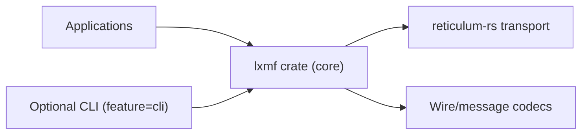

# LXMF-rs

Rust implementation of LXMF with a reliability-first design.

## Project Goals
- Lightweight, portable protocol library by default.
- Clear separation between protocol code and operator tooling.
- Deterministic behavior with strict CI quality gates.

## Repository Layout

```text
LXMF-rs/
├── crates/
│   └── lxmf/                # Core LXMF crate
│       ├── src/
│       └── tests/
├── docs/
│   ├── architecture/
│   ├── adr/
│   ├── compatibility-contract.md
│   └── compatibility-matrix.md
└── .github/workflows/ci.yml
```

## Architecture



## Build

```bash
# Core library (minimal surface)
cargo check --workspace --all-targets

# CLI-enabled build
cargo check --workspace --all-targets --all-features

# Fast local test run (core suite + CLI)
make test

# Optional compatibility/fullness sweeps
make test-all
make test-full-targets

# Run CLI
cargo run -p lxmf --features cli --bin lxmf -- --help
```

## Embedded Runtime API

For desktop apps (for example Tauri), use the embedded runtime feature and typed send helpers:

```rust
use lxmf::payload_fields::CommandEntry;
use lxmf::runtime::{self, RuntimeConfig, SendCommandRequest, SendMessageRequest};

let handle = runtime::start(RuntimeConfig {
    profile: "default".into(),
    rpc: None,
    transport: Some("127.0.0.1:0".into()),
})?;

let msg = SendMessageRequest::new(
    "ffeeddccbbaa99887766554433221100",
    "hello",
);
let _ = handle.send_message(msg)?;

let cmd = SendCommandRequest::new(
    "ffeeddccbbaa99887766554433221100",
    "ops bundle",
    vec![CommandEntry::from_text(1, "ping")],
);
let _ = handle.send_command(cmd)?;
```

Build with:

```bash
cargo add lxmf --features embedded-runtime
```

## Compatibility
- Cross-repo compatibility policy: `docs/compatibility-contract.md`
- Detailed parity mapping: `docs/compatibility-matrix.md`

## Not Included
- No bundled proprietary hardware integrations.
- No daemon/TUI coupling in default library build.
- No stability promise for pre-1.0 internals.

## Governance
- Contribution guide: `CONTRIBUTING.md`
- Security policy: `SECURITY.md`
- Code ownership: `.github/CODEOWNERS`

## License
MIT
