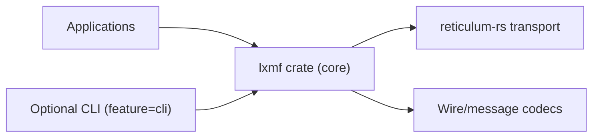

# LXMF-rs

Rust implementation of LXMF with a reliability-first design.

## Project Goals
- Lightweight, portable protocol library by default.
- Clear separation between protocol code and operator tooling.
- Deterministic behavior with strict CI quality gates.

## Repository Layout

```text
LXMF-rs/
├── crates/
│   └── lxmf/                # Core LXMF crate
│       ├── src/
│       └── tests/
├── docs/
│   ├── architecture/
│   ├── adr/
│   ├── compatibility-contract.md
│   └── compatibility-matrix.md
└── .github/workflows/ci.yml
```

## Architecture



## Build

```bash
# Core library (minimal surface)
cargo check --workspace --all-targets

# CLI-enabled build
cargo check --workspace --all-targets --all-features

# Run CLI
cargo run -p lxmf --features cli --bin lxmf -- --help
```

## Compatibility
- Cross-repo compatibility policy: `docs/compatibility-contract.md`
- Detailed parity mapping: `docs/compatibility-matrix.md`

## Not Included
- No bundled proprietary hardware integrations.
- No daemon/TUI coupling in default library build.
- No stability promise for pre-1.0 internals.

## Governance
- Contribution guide: `CONTRIBUTING.md`
- Security policy: `SECURITY.md`
- Code ownership: `.github/CODEOWNERS`

## License
MIT
