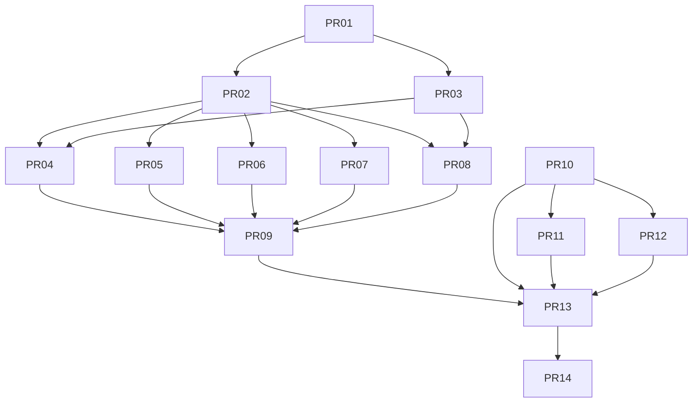

# Cross-Platform Interface Rollout PR Roadmap (Serial + BLE + LoRa + Mobile BLE)

Status: in-progress (PR-09 startup policy + degraded-mode semantics implemented)
Date: 2026-02-22
Owner: platform/networking
Audience: maintainers of `reticulumd`, `rns-transport`, CI/release engineering

## 1) Executive Summary
This roadmap adds three new runtime interfaces to `reticulumd`:

1. `serial`
2. `ble_gatt`
3. `lora`

It also establishes a mobile BLE track (Android + iOS) using a shared host-adapter contract so the same `ble_gatt` semantics can be implemented on mobile without introducing daemon-only assumptions.

The plan is organized as a PR-by-PR backlog with explicit dependencies, code touchpoints, acceptance tests, and rollback criteria. The priority order is:

1. Foundation and config contract
2. Serial (first production interface)
3. BLE (Linux -> macOS -> Windows)
4. LoRa
5. Mobile BLE host contract and conformance
6. CI hardening and docs/runbooks

## 2) Scope and Constraints
## 2.1 In Scope
1. Add startup-configurable `serial`, `ble_gatt`, and `lora` interface kinds for `reticulumd`.
2. Keep existing TCP behavior backward-compatible.
3. Add deterministic validation and startup behavior for new interfaces.
4. Add cross-platform BLE backends for Linux/macOS/Windows under a shared backend trait.
5. Add mobile BLE host contract + conformance suites for Android and iOS integrations.
6. Add CI coverage for desktop OS matrix and featureless target builds.

## 2.2 Out of Scope (v1)
1. Runtime hot-apply of new interface kinds via RPC.
2. Distributed/multi-primary coordination semantics.
3. End-to-end mobile app implementation in this repository (mobile app repos consume the contract and conformance fixtures).
4. Replacing existing transport packet semantics.

## 2.3 Hard Constraints
1. No user-facing Cargo feature toggles required to activate interface behavior by config.
2. Platform-specific dependency usage must remain compile-safe by target OS selection.
3. `rns-transport` remains runtime-agnostic for BLE/LoRa; serial worker support may live in `rns-transport` because `InterfaceManager` lifecycle ownership is there.
4. Boundary checks must pass (`tools/scripts/check-boundaries.sh`).

## 2.4 Runtime Mutation Contract (Mandatory v1 Behavior)
The following behavior is required and must be reflected in `docs/contracts/rpc-contract.md`:

1. `set_interfaces`:
1. If any interface entry in the request is `serial`, `ble_gatt`, or `lora`, reject the entire request.
2. Do not partially apply mixed requests; response is deterministic error `UNSUPPORTED_MUTATION_KIND_REQUIRES_RESTART`.
3. Legacy TCP-only requests retain existing behavior.
2. `reload_config`:
1. If config diff introduces, removes, or modifies `serial`, `ble_gatt`, or `lora`, return `RESTART_REQUIRED` and keep existing active interfaces unchanged.
2. Hot-apply is allowed only for existing legacy TCP interfaces when the diff changes existing TCP fields only (`enabled`, endpoint host/port, reconnect/backoff tuning) without adding/removing interface entries.
3. Any interface count change, kind change, or non-legacy interface mutation returns `RESTART_REQUIRED`.
3. Error payloads:
1. Must include machine code + human message + affected interface names.
2. Must be stable for client automation and conformance tests.
4. Observable success criteria for accepted hot-apply:
1. RPC returns success code with list of applied interface IDs.
2. Runtime status/snapshot reflects updated TCP settings.
3. No restart is triggered and no non-TCP interface state changes.

## 2.5 Dependency and Toolchain Policy
1. Workspace `rust-version` remains `1.75` and default toolchain remains `stable`.
2. Platform-specific dependencies for BLE must be target-scoped in `crates/apps/reticulumd/Cargo.toml` using `target.'cfg(...)'.dependencies`.
3. `rns-transport` and `lxmf-sdk` must not gain desktop OS-specific BLE dependencies.
4. `Cargo.lock` updates are expected and must remain deterministic.
5. Required compile matrix policy for new interface code:
1. Linux target compile path is validated.
2. macOS target compile path is validated.
3. Windows target compile path is validated.
4. `--all-targets` coverage is included in CI for the affected crates.

## 3) Repo Touchpoint Map
Primary files/directories expected to change:

1. `crates/apps/reticulumd/src/config.rs`
2. `crates/apps/reticulumd/src/bin/reticulumd/bootstrap.rs`
3. `crates/apps/reticulumd/src/bin/reticulumd/rpc_loop.rs`
4. `crates/apps/reticulumd/src/bin/reticulumd/main.rs`
5. `crates/apps/reticulumd/src/bin/reticulumd/interfaces/` (new module tree)
6. `crates/apps/reticulumd/tests/` (new interface-focused tests)
7. `crates/libs/rns-transport/src/iface.rs`
8. `crates/libs/rns-transport/src/iface/` (new worker helper(s))
9. `crates/libs/rns-rpc/src/rpc/daemon/dispatch_legacy_messages.rs`
10. `crates/libs/rns-rpc/src/rpc/daemon/dispatch_legacy_router.rs`
11. `crates/libs/rns-rpc/tests/` (new RPC policy tests)
12. `.github/workflows/ci.yml`
13. `.github/workflows/nightly-embedded-hil.yml`
14. `docs/runbooks/` (new interface runbooks)
15. `README.md` and/or product-facing docs
16. `crates/apps/reticulumd/Cargo.toml` (target-scoped interface dependencies)
17. `crates/libs/lxmf-sdk/Cargo.toml` (mobile host contract integration only; no OS-specific BLE deps)
18. `Cargo.toml` (workspace-level dependency pin updates if needed)
19. `Cargo.lock`

## 4) Delivery Milestones
Milestones are cumulative:

1. M1: Foundation + parser + startup plumbing in place
2. M2: Serial production-ready
3. M3: BLE production-ready on Linux/macOS/Windows
4. M4: LoRa production-ready with fail-closed compliance policy
5. M5: Mobile BLE host contract and conformance published
6. M6: CI/release hardening + operator docs complete

## 5) PR Dependency Graph

## 6) PR Backlog (Detailed)
## PR-01: Foundation Scope Lock + Config Contract
Branch: `codex/pr-01-interface-scope-config-contract`

### Objective
1. Establish additive config schema for new interface kinds.
2. Preserve existing TCP compatibility.
3. Enforce startup-only semantics for new kinds.

### Files
1. `crates/apps/reticulumd/src/config.rs`
2. `crates/apps/reticulumd/tests/config.rs`
3. `crates/apps/reticulumd/src/bin/reticulumd/rpc_loop.rs`
4. `crates/apps/reticulumd/tests/rpc_interface_mutation_policy.rs` (new)
5. `crates/apps/reticulumd/tests/rpc_reload_config_policy.rs` (new)
6. `crates/libs/rns-rpc/src/rpc/daemon/dispatch_legacy_messages.rs`
7. `crates/libs/rns-rpc/src/rpc/daemon/dispatch_legacy_router.rs`
8. `crates/libs/rns-rpc/tests/interface_mutation_policy.rs` (new)
9. `docs/contracts/rpc-contract.md` (scope note + deterministic restart-required errors)
10. `docs/plans/2026-02-22-cross-platform-interfaces-pr-roadmap.md` (this file stays current)

### Implementation Tasks
1. Extend `InterfaceConfig` to support typed `settings` payload while preserving current fields.
2. Add strict settings validation for `serial`, `ble_gatt`, `lora`.
3. Keep legacy `tcp_client` and `tcp_server` acceptance unchanged.
4. Ensure unknown keys are rejected for new kinds and tolerated only where explicitly legacy-compatible.
5. Add explicit parser errors with deterministic messages.
6. Codify `set_interfaces` rejection semantics for `serial`, `ble_gatt`, and `lora` (no partial apply).
7. Codify `reload_config` restart-required semantics when these kinds are changed.
8. Codify allowed `reload_config` hot-apply surface to existing legacy TCP fields only (`enabled`, endpoint, reconnect/backoff settings).
9. Expose applied-vs-rejected interface IDs in RPC response payloads for deterministic observability.
10. Align `rns-rpc` legacy method dispatch implementation with the same policy to avoid daemon vs client contract drift.

### Tests
1. Parser accepts existing TCP examples unchanged.
2. Parser rejects missing required settings for each new kind.
3. Parser rejects unknown settings keys for new kinds.
4. Parser handles disabled entries consistently.
5. `set_interfaces` rejects new kinds with deterministic machine code and zero side effects.
6. `reload_config` returns restart-required for new-kind diffs and preserves active runtime state.
7. `reload_config` accepts legacy TCP-only diffs and runtime snapshot reflects updated TCP endpoint/backoff.
8. Mixed diff test (`tcp` update + `ble_gatt` addition) is rejected atomically with no partial apply.

### Acceptance Commands
1. `cargo test -p reticulumd --test config`
2. `cargo test -p reticulumd --test rpc_interface_mutation_policy`
3. `cargo test -p reticulumd --test rpc_reload_config_policy`
4. `cargo test -p rns-rpc --test interface_mutation_policy`
5. `cargo check -p reticulumd`
6. `cargo check -p rns-rpc`

### Rollback Criteria
1. If legacy TCP config regression appears, revert schema expansion and reintroduce via compatibility wrapper.

---
## PR-02: Interface Module Scaffolding + OS Dispatch
Branch: `codex/pr-02-interface-module-os-dispatch`

### Objective
1. Introduce `interfaces` module layout.
2. Add shared interface backend trait(s) for BLE dispatch.
3. Wire startup dispatcher from config kind -> backend.

### Files
1. `crates/apps/reticulumd/src/bin/reticulumd/interfaces/mod.rs` (new)
2. `crates/apps/reticulumd/src/bin/reticulumd/interfaces/common.rs` (new)
3. `crates/apps/reticulumd/src/bin/reticulumd/bootstrap.rs`
4. `crates/apps/reticulumd/src/bin/reticulumd/main.rs`
5. `crates/apps/reticulumd/tests/iface_dispatch.rs` (new)
6. `crates/apps/reticulumd/Cargo.toml`
7. `Cargo.lock`

### Implementation Tasks
1. Create internal `InterfaceBackend` trait for spawn/start lifecycle.
2. Add dispatch layer for `serial`, `ble_gatt`, `lora`, existing TCP.
3. Add target-OS BLE backend selection (`cfg(target_os = "linux"|"macos"|"windows")`).
4. Add consistent startup log lines for each interface registration outcome.
5. Introduce target-scoped dependency stubs only under `reticulumd` to keep `rns-transport` runtime-agnostic.
6. Add explicit unsupported-platform compile path that returns deterministic diagnostics.

### Tests
1. Dispatch test for each interface kind.
2. Unsupported-OS fallback behavior test for BLE backend dispatch.
3. No hidden global feature toggles required for dispatch behavior by config kind.

### Acceptance Commands
1. `cargo test -p reticulumd --test iface_dispatch`
2. `cargo check -p reticulumd --all-targets`
3. `cargo test -p reticulumd --test config`

### Rollback Criteria
1. If bootstrap behavior regresses for TCP, revert dispatch indirection and reintroduce in smaller patch.

---
## PR-03: Shared Embedded Worker Utility in `rns-transport`
Branch: `codex/pr-03-rns-transport-embedded-worker`

### Objective
1. Add reusable worker glue for adapter-style interfaces.
2. Keep packet boundary invariant (transport sees full packets only).

### Files
1. `crates/libs/rns-transport/src/iface.rs`
2. `crates/libs/rns-transport/src/iface/embedded_worker.rs` (new)
3. `crates/libs/rns-transport/tests/embedded_link_contract.rs`
4. `crates/libs/rns-transport/tests/embedded_iface_worker.rs` (new)

### Implementation Tasks
1. Add helper for bridging `TxMessage`/`RxMessage` to adapter send/poll methods.
2. Keep send queue backpressure semantics consistent with existing interfaces.
3. Ensure decode/encode failures are non-panicking and logged deterministically.

### Tests
1. Adapter poll idle behavior does not block transport loop.
2. Oversized frame rejection path is deterministic.
3. Worker cancellation is graceful.

### Acceptance Commands
1. `cargo test -p rns-transport --test embedded_link_contract`
2. `cargo test -p rns-transport --test embedded_iface_worker`

### Rollback Criteria
1. If transport behavior changes unexpectedly, keep worker local to `reticulumd` and revisit upstream abstraction later.

---
## PR-04: Serial Adapter (Production)
Branch: `codex/pr-04-serial-adapter`

### Objective
1. Implement serial interface with robust framing and reconnect.

### Files
1. `crates/apps/reticulumd/src/bin/reticulumd/interfaces/serial.rs` (new)
2. `crates/apps/reticulumd/src/bin/reticulumd/interfaces/mod.rs`
3. `crates/apps/reticulumd/src/bin/reticulumd/bootstrap.rs`
4. `crates/apps/reticulumd/tests/iface_serial.rs` (new)
5. `crates/apps/reticulumd/Cargo.toml`
6. `Cargo.lock`

### Implementation Tasks
1. Implement serial open/read/write lifecycle.
2. Use HDLC framing + CRC/FCS validation prior to packet deserialize.
3. Add bounded queue controls and reconnect backoff.
4. Normalize error classes (port missing, permission denied, framing invalid).

### Tests
1. PTY loopback integration test.
2. Malformed frame rejection test.
3. Reconnect on disconnection test.

### Acceptance Commands
1. `cargo test -p reticulumd --test iface_serial`
2. `cargo check -p reticulumd --all-targets`

### Rollback Criteria
1. If adapter causes startup instability, gate serial activation by explicit config opt-in while keeping code landed.

---
## PR-05: BLE Linux Backend
Branch: `codex/pr-05-ble-linux`

### Objective
1. Ship Linux BLE backend under shared BLE trait.

### Files
1. `crates/apps/reticulumd/src/bin/reticulumd/interfaces/ble/mod.rs` (new)
2. `crates/apps/reticulumd/src/bin/reticulumd/interfaces/ble/linux.rs` (new)
3. `crates/apps/reticulumd/tests/iface_ble_linux.rs` (new)
4. `crates/apps/reticulumd/Cargo.toml`
5. `Cargo.lock`

### Implementation Tasks
1. Implement discover/connect/subscribe/read/write lifecycle.
2. Handle disconnect and reconnect with bounded backoff.
3. Keep MTU fragmentation/reassembly adapter-local.
4. Ensure permissions/bluetooth-off states are clear and non-panicking.
5. Keep Linux BLE dependency target-scoped to Linux only.

### Tests
1. State machine transition coverage.
2. Notification + write roundtrip via mock backend.
3. Reconnect behavior test.

### Acceptance Commands
1. `cargo test -p reticulumd --test iface_ble_linux`
2. `cargo check -p reticulumd --all-targets`

### Rollback Criteria
1. If runtime BLE dependency destabilizes Linux build, isolate dependency wrapper while keeping trait contract.

---
## PR-06: BLE macOS Backend
Branch: `codex/pr-06-ble-macos`

### Objective
1. Bring BLE backend parity to macOS.

### Files
1. `crates/apps/reticulumd/src/bin/reticulumd/interfaces/ble/macos.rs` (new)
2. `crates/apps/reticulumd/tests/iface_ble_macos.rs` (new)
3. `crates/apps/reticulumd/Cargo.toml`
4. `Cargo.lock`

### Implementation Tasks
1. Match Linux behavioral contract (state, reconnect, error mapping).
2. Map platform-specific permission signals to normalized diagnostics.

### Tests
1. Same logical conformance suite as Linux backend.

### Acceptance Commands
1. `cargo test -p reticulumd --test iface_ble_macos`
2. `cargo check -p reticulumd --all-targets`
3. macOS CI runner build/test green.

### Rollback Criteria
1. If macOS-specific dependency conflicts are unresolved, keep this PR unmerged and block BLE milestone sign-off.

---
## PR-07: BLE Windows Backend
Branch: `codex/pr-07-ble-windows`

### Objective
1. Bring BLE backend parity to Windows.

### Files
1. `crates/apps/reticulumd/src/bin/reticulumd/interfaces/ble/windows.rs` (new)
2. `crates/apps/reticulumd/tests/iface_ble_windows.rs` (new)
3. `crates/apps/reticulumd/Cargo.toml`
4. `Cargo.lock`

### Implementation Tasks
1. Match shared BLE backend contract.
2. Normalize platform-specific errors.

### Tests
1. Windows conformance suite equivalent to Linux/macOS.

### Acceptance Commands
1. `cargo test -p reticulumd --test iface_ble_windows`
2. `cargo check -p reticulumd --all-targets`
3. Windows CI runner build/test green.

### Rollback Criteria
1. If Windows parity cannot be achieved, block BLE milestone release and continue only serial/LoRa tracks until parity is restored.

---
## PR-08: LoRa Adapter (Production + Compliance)
Branch: `codex/pr-08-lora-adapter`

### Objective
1. Implement LoRa adapter with strict safety/compliance defaults.

### Files
1. `crates/apps/reticulumd/src/bin/reticulumd/interfaces/lora.rs` (new)
2. `crates/apps/reticulumd/tests/iface_lora.rs` (new)
3. `crates/apps/reticulumd/src/bin/reticulumd/bootstrap.rs`
4. `crates/apps/reticulumd/src/bin/reticulumd/interfaces/lora_state.rs` (new)
5. `crates/apps/reticulumd/Cargo.toml`
6. `Cargo.lock`

### Implementation Tasks
1. Add adapter-local fragmentation/reassembly with explicit caps.
2. Require region profile; reject invalid/unknown profile.
3. Persist duty-cycle debt and enforce before first TX after restart.
4. Enter no-TX fail-closed state on uncertain compliance conditions.
5. Persist duty-cycle state with atomic write + fsync (`*.tmp` + rename) and schema versioning.
6. Define corruption handling: unreadable/invalid state enters no-TX fail-closed until operator reset.
7. Define restart-time semantics:
1. Store both wall-clock timestamp and elapsed debt metadata.
2. If restart clock appears to move backward or uncertainty exceeds threshold, remain no-TX fail-closed.
3. Require explicit operator action to clear uncertain state.

### Tests
1. Reorder/loss/dup simulation tests.
2. Resource-cap pressure tests.
3. Restart duty-cycle persistence tests.
4. Corrupted persistence state recovery test (must fail closed).
5. Clock rollback / large clock skew restart test (must fail closed).
6. Atomic persistence crash-interruption test (no partial state accepted).

### Acceptance Commands
1. `cargo test -p reticulumd --test iface_lora`
2. `cargo check -p reticulumd --all-targets`

### Rollback Criteria
1. If compliance invariants cannot be guaranteed, disable TX path by policy and ship RX-only mode temporarily.

---
## PR-09: Startup Policy + Degraded Mode Semantics
Branch: `codex/pr-09-startup-policy-degraded`

### Objective
1. Make startup behavior deterministic when subset interfaces fail.

### Files
1. `crates/apps/reticulumd/src/bin/reticulumd/bootstrap.rs`
2. `crates/apps/reticulumd/tests/startup_interface_policy.rs` (new)

### Implementation Tasks
1. Define policy for partial startup vs hard-fail by interface class.
2. Ensure failed interfaces are surfaced via explicit status entries.
3. Keep daemon from panic/abort unless configured strict policy demands it.

### Tests
1. Single interface init failure in mixed interface config.
2. All interfaces fail behavior.
3. Compliance-sensitive LoRa fail-closed behavior.

### Acceptance Commands
1. `cargo test -p reticulumd --test startup_interface_policy`

### Rollback Criteria
1. If policy causes ambiguous runtime behavior, default to strict fail-closed for all new interface kinds.

---
## PR-10: Mobile BLE Host Adapter Contract (SDK Surface)
Branch: `codex/pr-10-mobile-ble-host-contract`

### Objective
1. Define stable Rust-side contract for mobile host BLE integration.

### Files
1. `crates/libs/lxmf-sdk/src/backend.rs`
2. `crates/libs/lxmf-sdk/src/backend/mobile_ble.rs` (new)
3. `crates/libs/lxmf-sdk/src/client/tests.rs`
4. `docs/contracts/mobile-ble-host-contract.md` (new)
5. `crates/libs/lxmf-sdk/tests/mobile_ble_contract.rs` (new)
6. `crates/libs/lxmf-sdk/Cargo.toml`

### Implementation Tasks
1. Add host adapter trait(s) for BLE operations and event callbacks.
2. Define required authz/replay semantics parity with existing mutation paths.
3. Define capability reporting for mobile host features.
4. Define callback ordering guarantees (connect/disconnect/notify/error ordering is deterministic per session).
5. Define threading/reentrancy rules (callbacks non-reentrant by contract; host runtime must serialize callback dispatch).
6. Define backpressure and queue overflow behavior for notification delivery.
7. Define cancellation + timeout contract for connect/write/read calls.

### Tests
1. Contract conformance tests for mock host adapter.
2. Error mapping and retry semantics tests.
3. Callback ordering contract tests.
4. Cancellation and timeout conformance tests.
5. Backpressure behavior tests.

### Acceptance Commands
1. `cargo test -p lxmf-sdk --test mobile_ble_contract`
2. `cargo check -p lxmf-sdk --all-targets`

### Rollback Criteria
1. If contract is unstable, freeze as internal module and publish docs only after conformance settles.

---
## PR-11: Android BLE Conformance Milestone
Branch: `codex/pr-11-android-ble-conformance`

### Objective
1. Provide Android conformance harness and fixtures for mobile integration.

### Files
1. `docs/mobile/android-ble.md` (new)
2. `docs/fixtures/mobile-ble/android/` (new)
3. `docs/fixtures/mobile-ble/shared/` (new)
4. `crates/libs/test-support/tests/mobile_ble_android_conformance.rs` (new)
5. `crates/libs/test-support/Cargo.toml`

### Implementation Tasks
1. Define Android-side required behavior against host contract.
2. Provide test vector set for connect/reconnect/permission denial/replay checks.
3. Define artifact format expected from Android CI pipeline.

### Tests
1. Shared conformance runner validates Android fixture outputs.
2. Conformance test fails on callback ordering drift and retry-policy drift.

### Acceptance Commands
1. `cargo test -p test-support --test mobile_ble_android_conformance`

### Rollback Criteria
1. If external mobile pipeline unavailable, keep fixtures + local mock conformance as minimum baseline.

---
## PR-12: iOS BLE Conformance Milestone
Branch: `codex/pr-12-ios-ble-conformance`

### Objective
1. Provide iOS conformance harness and fixtures.

### Files
1. `docs/mobile/ios-ble.md` (new)
2. `docs/fixtures/mobile-ble/ios/` (new)
3. `docs/fixtures/mobile-ble/shared/` (updates)
4. `crates/libs/test-support/tests/mobile_ble_ios_conformance.rs` (new)
5. `crates/libs/test-support/Cargo.toml`

### Implementation Tasks
1. Define iOS-side required behavior against host contract.
2. Include background restore limitations and expected semantics where applicable.

### Tests
1. Shared conformance runner validates iOS fixture outputs.
2. Conformance test fails on ordering/reentrancy/backpressure contract drift.

### Acceptance Commands
1. `cargo test -p test-support --test mobile_ble_ios_conformance`

### Rollback Criteria
1. If iOS-specific behaviors conflict with base contract, split optional capability flags rather than forking core semantics.

---
## PR-13: CI Matrix Hardening
Branch: `codex/pr-13-ci-matrix-interfaces`

### Objective
1. Enforce deterministic coverage across OSes and interfaces.

### Files
1. `.github/workflows/ci.yml`
2. `.github/workflows/nightly-embedded-hil.yml`
3. `xtask/src/main.rs`

### Implementation Tasks
1. Add Linux/macOS/Windows BLE matrix jobs.
2. Add serial and LoRa deterministic test jobs.
3. Keep HIL jobs nightly/additive.
4. Ensure boundary checks run in matrix baseline.
5. Define branch-protection required jobs explicitly:
1. `interfaces-build-linux`
2. `interfaces-build-macos`
3. `interfaces-build-windows`
4. `interfaces-test-serial`
5. `interfaces-test-ble-linux`
6. `interfaces-test-ble-macos`
7. `interfaces-test-ble-windows`
8. `interfaces-test-lora`
9. `interfaces-test-mobile-contract`
10. `interfaces-boundary-check`
6. Add `cargo xtask ci --stage interfaces-required` aggregator stage that fails if any required interface job contract is missing.

### Tests
1. CI workflow self-check and dry run where possible.

### Acceptance Commands
1. `bash tools/scripts/check-boundaries.sh`
2. `cargo xtask ci --stage interfaces-required`
3. CI is green for all required jobs listed above.

### Rollback Criteria
1. If matrix cost is too high, reduce by sharding while preserving must-pass jobs.

---
## PR-14: Docs, Runbooks, and Operator Guidance
Branch: `codex/pr-14-interfaces-docs-runbooks`

### Objective
1. Make operation/debugging/recovery predictable for users.

### Files
1. `README.md`
2. `docs/runbooks/reticulumd-serial-interface.md` (new)
3. `docs/runbooks/reticulumd-ble-interface.md` (new)
4. `docs/runbooks/reticulumd-lora-interface.md` (new)
5. `docs/runbooks/mobile-ble-conformance.md` (new)

### Implementation Tasks
1. Add concrete config examples for each interface kind.
2. Add troubleshooting trees and known failure signatures.
3. Document explicit v1 scope limits.

### Tests
1. Doc link consistency checks (if available in repo workflows).

### Acceptance Commands
1. `cargo xtask release-check`

### Rollback Criteria
1. If docs drift during rollout, block final release until runbooks match shipped behavior.

---
## 7) Cross-PR Global Acceptance Checklist
All items must be true before final rollout sign-off:

1. `serial`, `ble_gatt`, `lora` parse and validate deterministically.
2. Existing TCP config behavior is unchanged for legacy users.
3. New interface adapters are startup-loadable without panic paths.
4. BLE behavior contract is consistent across Linux/macOS/Windows.
5. LoRa compliance guard defaults to no-TX on uncertain state.
6. Boundary checks pass.
7. Required CI jobs are green: `interfaces-build-linux`, `interfaces-build-macos`, `interfaces-build-windows`, `interfaces-test-serial`, `interfaces-test-ble-linux`, `interfaces-test-ble-macos`, `interfaces-test-ble-windows`, `interfaces-test-lora`, `interfaces-test-mobile-contract`, `interfaces-boundary-check`.
8. Docs/runbooks are present and match implementation.
9. Mobile BLE host contract and conformance artifacts are published.

## 8) Risk Register and Mitigations
1. OS BLE stack differences:
- Mitigation: shared backend trait + per-OS conformance suite.

2. Serial line noise/data corruption:
- Mitigation: CRC/FCS mandatory and parser fuzz coverage.

3. LoRa resource pressure/fragment abuse:
- Mitigation: hard caps + simulation adversarial tests.

4. CI runtime inflation:
- Mitigation: split deterministic must-pass vs nightly HIL tiers.

5. Mobile contract drift:
- Mitigation: shared fixture vectors and contract version pinning.

## 9) Suggested Execution Timeline
This schedule assumes 2-3 engineers with review bandwidth reserved. It includes explicit contingency slack.

1. Week 1: PR-01 and PR-03 (contract semantics + worker utility).
2. Week 2: PR-02 and PR-04 (dispatch scaffolding + serial production adapter).
3. Week 3: PR-05 and PR-08 (Linux BLE + LoRa compliance implementation).
4. Week 4: PR-06 and PR-07 (macOS + Windows BLE parity).
5. Week 5: PR-09 and PR-10 (startup policy + mobile host contract).
6. Week 6: PR-11 and PR-12 (Android/iOS conformance fixtures and tests).
7. Week 7: PR-13 (CI hardening, required job enforcement, branch protection alignment).
8. Week 8: PR-14 + release-readiness gate and bug-fix buffer.

## 9.1 Gate Criteria by Week
1. Gate A (end of Week 2): PR-01..PR-04 merged, no TCP regressions, startup mutation contract tests passing.
2. Gate B (end of Week 4): BLE parity tests pass on Linux/macOS/Windows and LoRa fail-closed tests pass.
3. Gate C (end of Week 6): Mobile host contract tests + Android/iOS conformance tests pass in CI.
4. Gate D (end of Week 8): Required CI jobs are branch-protected and runbooks match shipped behavior.

## 10) Change Control
1. Any proposal to add live reconfiguration for new interface kinds requires a new dedicated plan.
2. Any proposal to support distributed ownership/topologies requires a separate architecture decision record.
3. Scope exceptions must be documented in this file before implementation.
